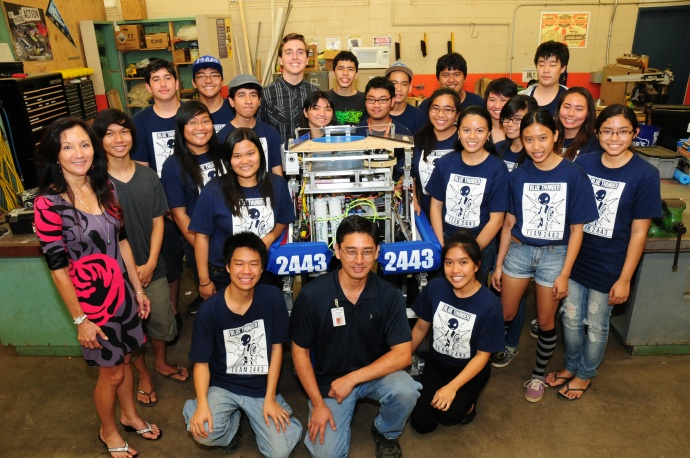

## Interest 
My interest in the STEM field started in high school where I took computer courses for my electives. I also joined the Robotics team where I learned about the physical components of electronics. I got a small taste of programming while in these programs but not anything substantial enough to pike my interest in the subject.

Once I got into Manoa I started on my way to becoming an Electrical Engineer. During this time I took my first real programming course and started to enjoy the challenege that came with it. Over the course of my first year, after a few considerations, I decided to enter the Computer Engineering major in order to follow a more programming intensive major. 

## Hope

I hope that in the future I can become a skilled programmer in C++, Python, and Unity. I want to have these in my arsenal so I have the ability to work in many different fields, but mostly in software engineering or game development. I am also looking forward to being able to work with different people with similiar interests so that I can take some of their skills and techniques ands apply it to my own work.
