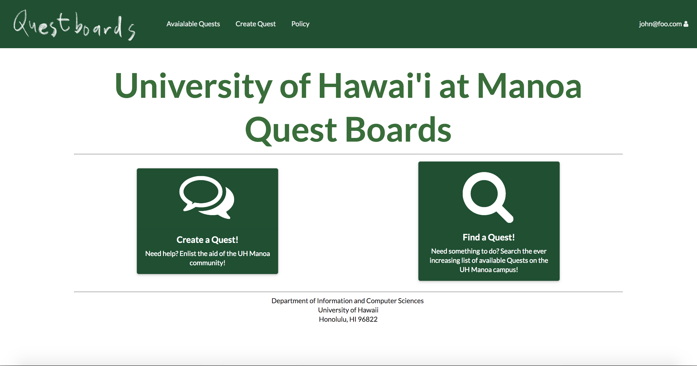
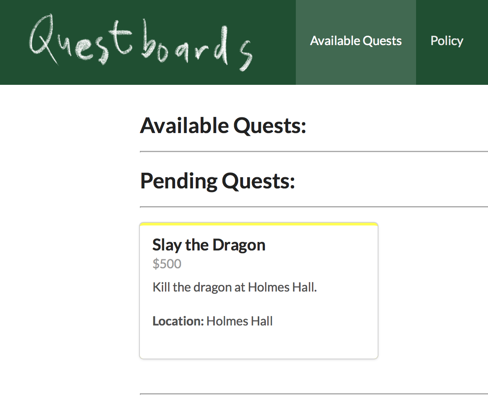

This website was made in order for students to find quick jobs that they could complete for cash. I worked with 2 other students to complete this website. I worked on creating the create job page, working on the job schema, and the edit jobs page.

The home page gives the user the option to create a new quest, or to look at current open quests. If the click on the create new quest page they will either be routed to the sign in page or the create new quet page depending on whether or not that already have an account.

The list quest page displays all the possible quests that are available. Open quests are quests that no one has applied to yet. The pending quests are quests that the have people resquesting to take but not verified yet. The owner of a quest can edit the quest at anytime. When a quest is clicked on they are routed to the display quest page. This page lets the user see all the details of the quest that was not on the card. 

 
[link to website](https://questboards.meteorapp.com/#/)
